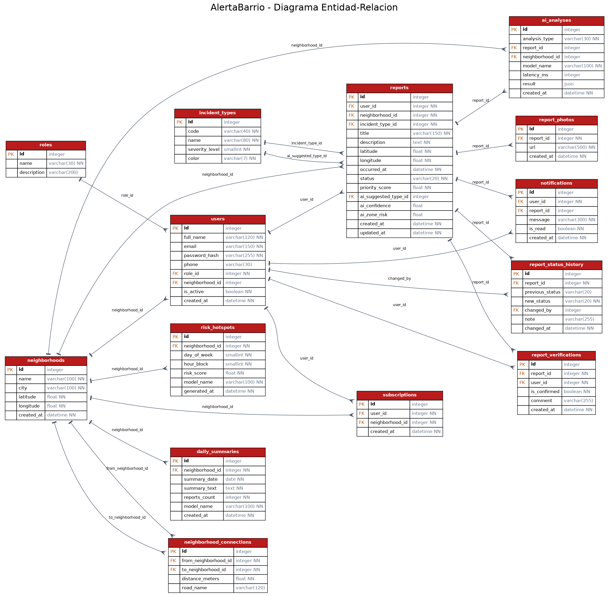

# AlertaBarrio · Base de datos

PostgreSQL 16. **14 tablas, nombres de tablas y columnas en inglés.**

| Tabla | Para qué |
|---|---|
| `roles` | citizen, moderator, admin |
| `users` | vecinos y moderadores (contraseña con bcrypt) |
| `neighborhoods` | barrios (vértices del grafo) |
| `neighborhood_connections` | vías entre barrios con distancia (aristas del grafo) |
| `incident_types` | tipos de incidente con gravedad 1–5 y color |
| `reports` | reportes, con estado, prioridad y resultado de la IA |
| `report_photos` | fotos de cada reporte |
| `report_status_history` | historial de estados (cada fila es un elemento de la pila) |
| `report_verifications` | confirmaciones de otros vecinos |
| `subscriptions` | vecino ↔ barrio que sigue |
| `notifications` | notificaciones entregadas (salen de la cola FIFO) |
| `ai_analyses` | bitácora de cada llamada a la IA: modelo, latencia, resultado |
| `daily_summaries` | resumen diario por barrio |
| `risk_hotspots` | riesgo por barrio, día y franja horaria (mapa de calor) |

## Archivos

- `schema.sql`: crear las tablas (`psql "$DATABASE_URL" -f schema.sql`)
- `seed.sql`: datos de ejemplo (14 barrios de Bogotá, 8 usuarios, ~150 reportes). Contraseña demo: `Alerta2026*`
- `er_diagram.png` / `.svg` / `.dot`: diagrama entidad-relación
- `generate_er_diagram.py`: regenera el diagrama desde los modelos del backend (requiere graphviz)

El backend también crea las tablas y carga los datos solo al arrancar si la BD está vacía.
